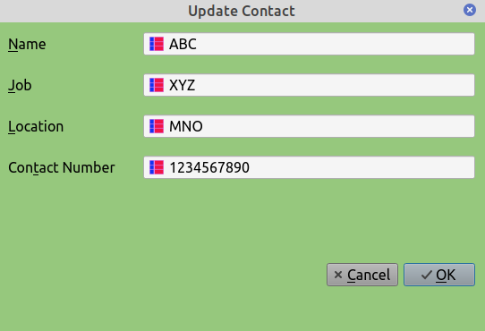
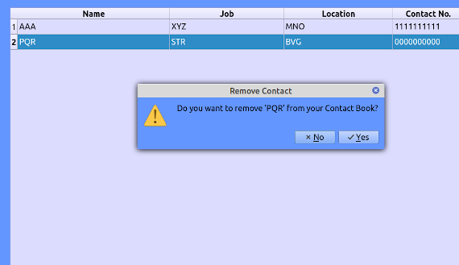

## About MyContacts
MyContacts is a simple desktop application which may be used to store important contact
numbers. The application has been created using python3, PySide6, SQLite3 and PyCharm Community
Edition. It has been developed and tested in Linux Mint only. As coding is my hobby, I have created
the application to test my knowledge on Python3 , PySide6 and on all other libraries mentioned above.
I hope the codes used in the application will help other Python3 and PySide6 developers who are absolutely
new to these areas. 

### Default username and password are appended below 
#### username ----> user
#### password ----> 1234

##### The username can not be changed.
##### It is recommended to change the default password after first login.

## Screenshots of the application

#### Login Window

#### Main Window

#### Add Contact Window

#### Update Contact Window

#### Remove Contact Window

#### Change Password Window

#### About Application Window

#### About Developer Window

